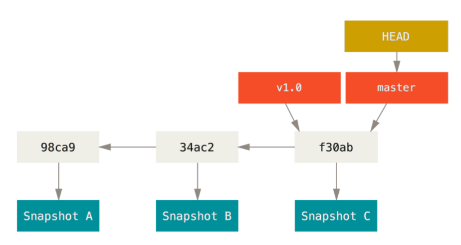

Uma branch é uma linha de trabalho independente. Podem ser usadas para diversos propósitos.

Pode-se ter uma branch para:

 - experimentar uma tecnologia nova;
 - uma branch para um bug-fix;
 - outra para o trabalho do sprint;

A branch padrão no git é a `master`. Para listar todas as branches
use: `git branch`


### Branches no git são baratas

A branch atual é aquela apontada pelo objeto HEAD.




```sh
cat .git/HEAD


```
Listando branches
-----------------

```sh
git branch
git branch -v
git branch --merged
git branch --no-merged

```

### Criando branches

```sh
git branch nova_branch

```

### Movendo para a branch

```sh
git checkout nova_branch

```

### Usando branches

```sh
#da master
git checkout -b "recursos_adicionais" #cria outra linha de trabalho
#adicionados recursos adicionais
git commit "recursos adicionais x,y,z"
git checkout -b "recursos_adicionais_extras" 
#mais recursos adicionais

```

### Merge

Merge mescla o conteúdo de branches

```sh
git merge recursos_adicionais
git log
git log [branch_name]

```

Fast-forward: move o ponteiro da master para o último commit da
branch. Possível utilizar quando não há divergências entre as
branches

```
git merge

```

### Deletando branch

```sh
git branch -d branch_name

```

