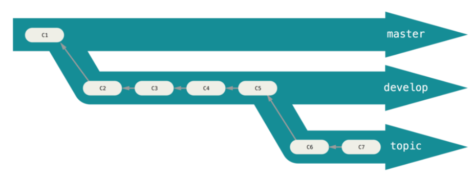

Modelos de versionamento
-------------------

 - Hierárquico
 - Centralizado
 - Distribuído

Git flow
--------

Mais adequado para software em versões.

- master
- develop
- topic
- [pu]
- [hotfix]
- [release]

[Githubflow](https://help.github.com/articles/github-flow/)
----------

Mais adequado para entrega contínua

 - Cria-se uma branch
 - Modifica-se conteúdo
 - Envia-se um pull request
 - Revisa-se o conteúdo e faz-se alterações no PR
 - Faz-se o merge do pull request para master
 - entrega-se a nova versão

Gitlab Flow
-----------

[https://about.gitlab.com/2014/09/29/gitlab-flow/](https://about.gitlab.com/2014/09/29/gitlab-flow/)

Estudando fluxos de projetos open-source
----------------------------------------

### Kernel

 - Mailing list + patches
 - Mantenedores de sub-sistemas

### PHP

 - Github
 - Pull-requests
 - [Contributing](https://github.com/php/php-src/blob/master/CONTRIBUTING.md)

### Node

 - Github
 - Pull-requests
 - [Contributing](https://github.com/nodejs/node/blob/master/CONTRIBUTING.md)
 - [Collaborator Guide](https://github.com/nodejs/node/blob/master/COLLABORATOR_GUIDE.md)

Mais sobre o assunto
--------------------

 - https://git-scm.com/book/en/v2/Distributed-Git-Distributed-Workflows#_distributed_git
 - https://git-scm.com/book/en/v2/Git-Branching-Branching-Workflows
 - https://lucamezzalira.com/2014/03/10/git-flow-vs-github-flow/
 - http://scottchacon.com/2011/08/31/github-flow.html
 - https://lucamezzalira.com/2014/03/10/git-flow-vs-github-flow/

