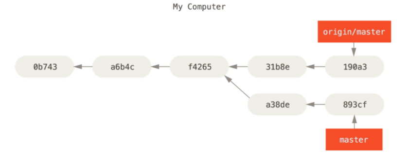

Remoto no filesystem local
--------------------------

```
cd /path/to/git-docs
cd ..
git clone git-docs other-git-docs
cd other-git-docs
git config user.name "other user"
git config user.email other.user@gmail.com
git ls-remote

//do some work
cd ../git-docs
git remote add other ../other-git-docs
git merge other/master
```

Remoto online
------------

### Listar os repositórios remotos

```
git remote -v

```

Inspecionando remoto
--------------------

```sh
git remote show
git remote show origin
git ls-remote

```
Branches remotas
----------------

Usar o padrão [remoto/branch]

```sh
git show origin/master

```



### Git remote add origin

```
git remote add origin git@github.com:compufour/compufacil.git
git remote add origin https://github.com/user/repo.git
```

### Mandar para o repositório

```
git clone https://github.com/JeanCarloMachado/git-docs
git push origin new_branch
```

### Baixar as modificações remotas no local

```sh
git fetch origin

```
### Pull

O *git pull* faz um fetch mais um merge.

```
git pull origin master

```


Setando remoto e branch padrões
-------------------------------

Permite usar apenas `git push`, ao invés de `git push origin
master`.

```
git branch --set-upstream-to myfork/master

```

Começando trabalho a partir de uma branch remota
------------------------------------------------

```sh
git checkout nome_da_branch_remota
ou
git checkout -b branch_remota origin/branch_remota

```

Listar as braches sincronizadas com o servidor
----------------------------------------------

```sh
git branch -vv

```

SSH
---


### Criando chaves

```sh
cd ~/.ssh
ssh-keygen

```

### Adicionando chaves

```
cat ~/.ssh/id_rsa.pub | copy

```

Credenciais https
-----------------

```sh
git config --global credential.helper 'cache --timeout=3600'
```
